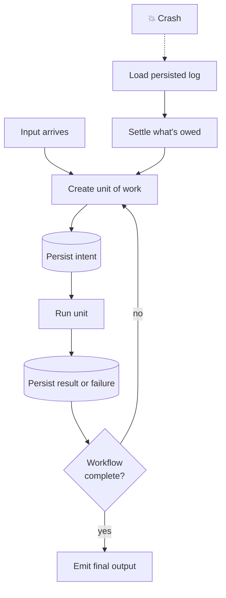

Orchestrating agents at scale seems to be a terrifying thought for most folks. How does one ensure that failures aren't catastrophic in a world of non-determinism? Simple: start from fundamental engineering practices and break operations down into units of work.

Fundamentally, every orchestration pattern follows the same sequence:

1. Create a fundamental unit of work.
2. Run that unit of work.
3. Persist it.
4. Continue until completion. On failure, if the unit was persisted correctly, pick up where you left off.

Recognizing the pattern is often harder than implementing it. Once the invariants are defined, the implementation is usually simple. Not trivial, but simple.

When we think of these systems as smaller units of work that all need completing, the fear of something sinister fades. The issue is that most people forget the patterns they've used time and time again. They tangle state, they don't define their units of work as composable pieces, and, most importantly, they forget that all systems are data pipelines.



This post goes into depth on the patterns I've used, from pipelines on edge devices to building and scaling agent platforms. I fundamentally believe there's no meaningful distinction of engineers or researchers; subject expertise can be gained, but only on top of foundational problem-solving skills.

I won't claim durability is simple at every level; there are tiers to building durable, scaled workflows, and the complexity compounds. What I'm claiming is that the _same patterns_ apply to any system, regardless of how much entropy it contains.

So here's the thesis up front, **durability is a logging discipline; scale and governance are separate problems.** Or, put at its sharpest: non-deterministic computation does not require non-deterministic infrastructure. The model can be chaotic. The orchestration layer shouldn't be.

## The prototype

Before we make persistence sound difficult, let's restate the contract: all workflows are composed of units of work, and those units can be stored and queried. That's it. This one pattern unlocks everything else.

What follows is a prototype, not a production system, but unlike most sketches, the ordering matters and is correct:

```go
package workflow

type Role string

const (
	RoleUser      Role = "user"      // a human
	RoleAssistant Role = "assistant" // the model
	RoleSystem    Role = "system"    // the orchestrator itself
)

type Kind string

const (
	KindMessage    Kind = "message"     // plain user or assistant text
	KindToolCall   Kind = "tool_call"   // an assistant message: a request
	KindToolResult Kind = "tool_result" // from system (API call) or user (HITL)
	KindFailure    Kind = "failure"     // a failed attempt is an output too
	KindFinal      Kind = "final"
)

// Unit is the atom: input in, output out. Role is the axis; Kind is
// the part that lives under it, mirroring the message model every
// provider already speaks:
//
//	RoleUser      -> KindMessage, KindToolResult (human-in-the-loop)
//	RoleAssistant -> KindMessage, KindToolCall, KindFinal
//	RoleSystem    -> KindToolResult (API call), KindFailure
type Unit struct {
	Seq    int
	Role   Role
	Kind   Kind
	Input  string
	Output string
}

// Store is the entire durability contract: Append must not return until
// the unit is durable. If a unit is in the log, it happened. If it
// isn't, it didn't. There is no third state.
type Store interface {
	Load(wid string) ([]Unit, error)
	Append(wid string, u Unit) error
}

// Run executes -- or resumes, which is the same thing -- workflow wid.
// step produces the next unit from history: a model turn, a tool
// execution, a subagent. The engine doesn't care which.
func Run(
	wid, query string,
	store Store,
	step func(history []Unit) (Unit, bool),
) (<-chan Unit, <-chan error) {
	units := make(chan Unit)
	errc := make(chan error, 1)

	go func() {
		defer close(units)
		defer close(errc)

		history, err := store.Load(wid)
		if err != nil {
			errc <- err
			return
		}

		// Write-ahead: durable first, visible second. Intent units
		// (tool calls) land in the log before their effects ever run.
		commit := func(u Unit) error {
			u.Seq = len(history)
			if err := store.Append(wid, u); err != nil {
				return err
			}
			history = append(history, u)
			units <- u
			return nil
		}

		// Fresh workflow: the query itself is the first unit.
		if len(history) == 0 {
			if err := commit(Unit{Role: RoleUser, Kind: KindMessage, Input: query}); err != nil {
				errc <- err
				return
			}
		}

		// Resuming a finished workflow re-executes nothing.
		if last := history[len(history)-1]; last.Kind == KindFinal {
			units <- last
			return
		}

		for {
			next, done := step(history)
			if err := commit(next); err != nil {
				errc <- err
				return
			}
			if done {
				return
			}
		}
	}()

	return units, errc
}
```

Four decisions in here do all the work:

**Persist, then emit.** `commit` is the only way a unit comes into existence: it's written to the store _before_ it's streamed to the caller. Reverse that order (persist asynchronously, fire and forget) and you've built a system that can show a caller work that never survived. The latency cost of a synchronous write is the price of being able to trust your own log.

**The log is write-ahead.** A call and its result are separate units, and the call comes first. In effect, we write down what is _going to happen_ before it happens: the `tool_call` unit is intent, persisted before the tool ever runs. This matters most for external tool calls, where we control neither the timing nor the outcome on the other side. And when an attempt fails, the failure gets persisted too, because a failure is an output like any other. So a retry is never made from assumption; the log states plainly that intent was declared, an attempt failed, and a result is still owed. Resuming and running are literally the same function. (Retrying an owed call is at-least-once execution, which is only safe if the unit's _effects_ are handled correctly. More on that below.)

**Everything is a unit, including subagents.** A subagent is not a special thing. It's the same loop with its own log, keyed under the parent's call (`wf-42/3`). If the child crashed halfway through, it resumes from _its_ log before the parent ever sees a result. Recursion gives you nested durability for free. And this is why agent orchestration is not some separate discipline you bolt on; it falls out of the pattern naturally. An agent can call agents precisely because every agent, by contract, produces a result, deterministic or not.

**Pausing is native.** Look at where a tool result can come from: the system role when the system made the API call, or the user role when a human supplied the answer. That second path means human-in-the-loop isn't a feature you build, it's a row you append. A call that needs human judgment lands in the log as owed intent, and the workflow simply stops. No process has to stay alive, because the workflow lives in the store, not in memory. When the data arrives, a minute or a month later, pull the state, append the result as a user-role unit, and resume. Approval gates, long waits, workflows that need time to exist: all natively supported by the same log.

And voilà, you have a basic framework for any workflow with an input and an output. Everything from agent orchestration to placing your favourite Uber Eats order.

You might say, "Well Urmzd, aren't agents non-deterministic?" and I'd say it depends on how you tune the entropy. But even fully non-deterministic, an agent produces an output that downstream systems can use. Whether those systems use it _correctly_ is an entirely different class of problem.

If this all feels familiar, it should. Durable agent systems borrow heavily from event sourcing, write-ahead logging, distributed sagas, and workflow engines; databases have been recovering from crashes exactly this way for decades. LLMs introduce probabilistic computation, not new laws of distributed systems.

## Agents are black boxes, and that's the point

When we think about what it means to make agents work, there's nothing simpler than the classical "black box" everyone reaches for in an interview. A function takes a value and produces some output. If the interface is understood and well contracted (or honestly, even if it isn't), we know we'll get _some_ artifact that can be worked on downstream: text, an image, a structured model, whatever.

When we think of agents specifically, remember:

- **LLMs take in tokens and spit out tokens.** The mechanism by which that happens is, for all intents and purposes, irrelevant to the orchestrator.
- **Hence, tool calls are a system mechanism, not an LLM mechanism.** The model only ever _requests_; the system decides whether and how to execute, and feeds the result back as another unit.
- **LLMs produce valid output structures because they've been trained to**, across every major model family, and where training isn't enough, constrained decoding and schema validation close the gap. Structure is a property of the contract, not luck.
- **MCP, skills, and friends are system-level patterns**, not model capabilities. They're all the same move: use the structured/unstructured boundary to pull context into the loop and push actions out of it. More units, same log.

I've been building these ideas out in the open in [saige](https://github.com/urmzd/saige), a Go SDK for streaming agents. It's the production-shaped version of the prototype above: the agent loop streams typed deltas, subagents are registered as tools and forwarded through the parent's stream with attribution, human-in-the-loop markers gate a tool call pending approval and resolve it with the human's data (the pause-and-resume above, made concrete), and the conversation tree, with branching, checkpoints, and rewind, _is_ the persistence layer. Same pattern, more units.

## When a unit of work writes

At-least-once retry is harmless when a unit only reads; call the search API twice, nobody cares. The moment a unit has _effects_, the unit of work must be defined around the effect. And here's the uncomfortable truth that workflow discussions quietly skip past:

**Most external systems are not idempotent.** A repeated `POST /users` doesn't give you `id=123` twice; it gives you `id=123` and `id=124`. A retried charge bills the card again. A retried send emails the customer again. Stripe charges without idempotency keys, GitHub issues, Slack messages, cloud provisioning, database DDL, nearly every CRUD API: at-least-once unsafe, all of them. The workflow engine cannot assume retries are safe. Either the target provides transactional or idempotent semantics, or the unit of work itself must be structured so that duplicate execution can be detected and settled correctly.

That gives you exactly four cases:

|Effect|Safe to retry?|What to do|
|---|---|---|
|Pure read|Yes|Retry freely|
|Transactional write|Usually|Retry within the transaction|
|Idempotent write|Yes|Idempotency keys, CAS, `UPSERT`|
|Non-idempotent write|No|Persist intent, settle carefully|

The last row is where most real APIs live, and it's why the write-ahead structure earlier isn't optional. For a non-idempotent effect, settling becomes check-then-act: read the target first (did a user with this request id already get created? does the table already exist?), record what you observed as a unit, and only then act or skip. This is the same reasoning distributed sagas are built on. You're not building an idempotent world; you're building a world where the log can always answer four questions: did we intend to do this, did we attempt it, did we observe success, and is the result still owed?

Two more rules complete the picture:

**If something downstream requires the write, depend on the store, not on context.** The hydrated history is for the model; it is not the source of truth for effects. The writing unit persists a _reference_ (a table name, a row id, an object key), and the downstream unit pulls by that reference, verifies the precondition actually holds, and fails gracefully, as its own logged unit, when it doesn't. This is the fundamental part: checking the store means every decision is based on the _current_ state of the system, never on what we assumed happened. A checkpoint is only valid if the state it claims still exists when you resume on top of it.

**Units talk through an interface, never through state directly.** One unit outputs to a location; the next unit checks that same location. Both go through the source of truth. In practice this is a rule for tool development: when an agent calls a tool, state should never be persisted or relayed _by the LLM_. Tool inputs and outputs are well-structured references into the store, not blobs of remembered fact. Strong units mean proper state management, and betting a scaled workflow or an agent orchestration on the model's recall being perfect, or on it never hallucinating a value, is a fundamental misunderstanding of what the model is. The log remembers; the model reasons.

Durability is not about making effects idempotent. It's about never having to guess what happened.

## Two places to checkpoint

So where does the persistence actually live? You have two options, and they're not mutually exclusive:

**a) Application-level checkpoints.** You own the schema. Every unit gets written to your store (Postgres, SQLite, an event log, whatever) through an interface like `Store` above. This is what the prototype does, and it's what saige's conversation tree does. The upside is total control: your log is your domain model, queryable on your terms, branchable, replayable. The downside is that _you_ are now responsible for the typing, the migrations, the idempotency fencing, and the recovery semantics.

**b) Infrastructure-level checkpoints.** This is where [DBOS](https://www.dbos.dev/) and [Temporal](https://temporal.io/) live, and they make the whole thing fundamentally easier in one specific way: you don't have to type the database. Annotate a function as a workflow and its steps, and the platform records every step's inputs and outputs into a durable, versioned history for free. Crash, redeploy, lose a node: the workflow replays from history and picks up exactly where it left off. The pattern is identical to the prototype; the bookkeeping just stops being your code.

They also hand you workers, services that pull units off a queue and execute them. And here's the thing: **workers are not fundamental to durability.** Durability needs only a log. Workers are the service pattern layered on top, and it's a genuinely useful one, because it's what lets you scale execution horizontally: more traffic, more workers, queue the backlog, rate-limit the spend.

Which surfaces the real distinction this post has been circling: **solving durability does not mean solving scale and governance.** Durability is a logging discipline: persist, then emit, settle what's owed. Scale and governance are different problem classes: replay safety across deploys, backpressure, queue fairness, retention policies, multi-tenancy, knowing who can touch what. And sitting underneath all of it, observability. When a workflow misbehaves at 2 a.m., being able to see where it is, why it failed, and pause, fork, or restart it from a specific step is the difference between an incident and a mystery. None of this is magic; both DBOS and Temporal are self-hostable and built from the same fundamentals as the prototype. The point isn't which tool to pick; it's knowing which problem you're actually solving. The prototype solves durability. The rest arrives with traffic, and it deserves its own deliberate decision.

Back to the point of workstreams, then. If a unit of work needs to be done, that fact itself gets persisted (intent is a unit too) and every checkpoint must be _stated_, never implied: the call in the log before the effect, the result in the log after it, failures recorded rather than swallowed, references in the store rather than facts floating in context. That's write-ahead logging, the same discipline your database has trusted for decades. Do it, and resumption stops being recovery and becomes the system's default mode of operation.

Durability is a log. Scale and governance are not, and knowing the difference is the whole game.

## Snippet of the Week

<details>
<summary>Double-Entry Bookkeeping — The 700-Year-Old Append-Only Log</summary>

#### The Foundation

Accountants solved durable, auditable state in the 13th century. The journal is an append-only log: transactions are recorded in order, and history is never edited. Made a mistake? You don't erase it — you append a _correcting entry_ that reverses it. If it's not in the journal, it didn't happen. Sound familiar?

- [Double-Entry Bookkeeping](https://en.wikipedia.org/wiki/Double-entry_bookkeeping)
- [Journal Entry](https://en.wikipedia.org/wiki/Journal_entry)

#### The Math

Every transaction touches at least two accounts, and debits must equal credits — an invariant checkable at any point in the log:

$$
\sum_{i=1}^{n} \text{debit}_i = \sum_{i=1}^{n} \text{credit}_i
$$

The ledger's running state is just a fold over the journal — the same way a workflow's state is a fold over its units:

$$
\text{balance}(a) = \sum_{t \in \text{journal}} \text{debit}_t(a) - \text{credit}_t(a)
$$

#### The Code

```python
from dataclasses import dataclass
from collections import defaultdict

@dataclass(frozen=True)
class Entry:
    seq: int
    debit: str    # account debited
    credit: str   # account credited
    amount: int   # cents -- never floats

journal: list[Entry] = []

def append(debit: str, credit: str, amount: int) -> Entry:
    entry = Entry(seq=len(journal), debit=debit, credit=credit, amount=amount)
    journal.append(entry)  # append-only: history is never edited
    return entry

def correct(bad: Entry) -> Entry:
    # A mistake is reversed by a new entry, not by rewriting the log.
    return append(debit=bad.credit, credit=bad.debit, amount=bad.amount)

def balances() -> dict[str, int]:
    # State is a fold over the journal -- replay it from zero, any time.
    acc: dict[str, int] = defaultdict(int)
    for e in journal:
        acc[e.debit] += e.amount
        acc[e.credit] -= e.amount
    return acc
```

#### The Connection

The journal is the `Store` from the prototype: append-only, ordered, and the sole source of truth. Correcting entries are the accounting version of "settle what's owed" — you never mutate history, you append the missing entry. And the trial balance is the replay check: fold the log from zero and the invariant must hold. Durable workflows aren't a new idea; they're bookkeeping with a non-deterministic clerk.

</details>
