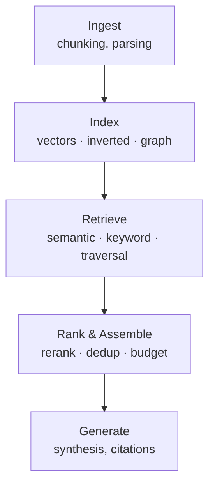
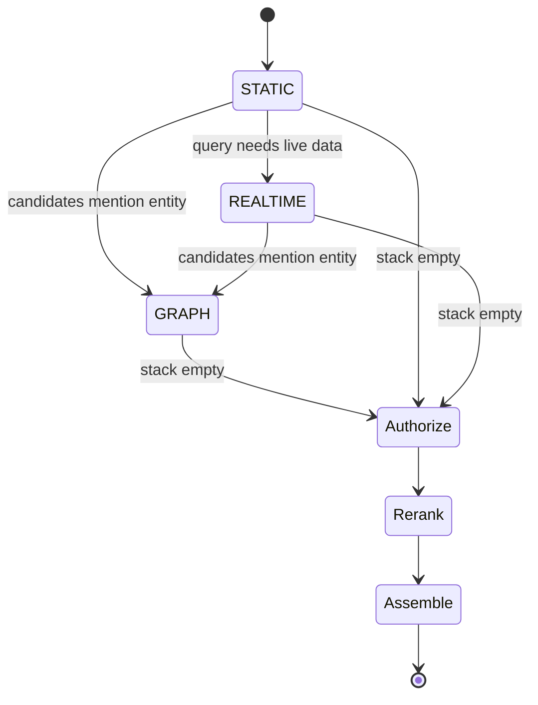
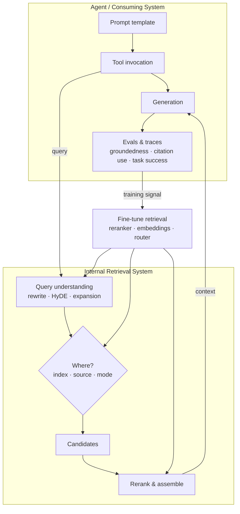
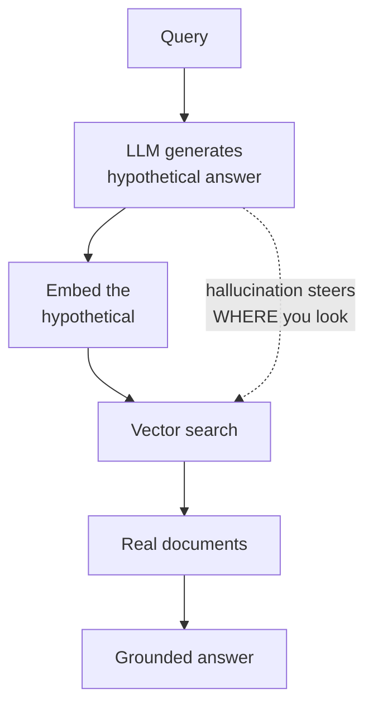

RAG has been declared dead every week for the past two years. If it were actually dead, it wouldn't be "killed" again after the release of the next vibe-coded project gone viral. Yet, here we are.

Let me be clear: RAG cannot die, and it's not because it's a word. It definitely isn't a technique either. At its heart, it's a concept, no matter how often everyone insists on treating it otherwise. My argument for that? Its definition. RAG stands for Retrieval-Augmented Generation. Effectively, any system that retrieves something from the outside world and injects it into a system that generates content is performing RAG. Take a piece of content that isn't in the model's training data, drop it in, and hit enter. Congratulations, you have RAG'd (no, I don't know the correct past tense either). Introduced a knowledge graph as an alternative to a traditional vector database? RAG. You didn't kill RAG, and you're not going to.

Now, there's obviously one interpretation you can argue: when people refer to "RAG," they mean the typical document-chunking-and-retrieval pipeline. That's one application of RAG, not RAG itself. It's like calling AI "LLMs." The inverse relationship holds (every LLM product is doing AI) but the reverse doesn't, and neither does it for RAG. Chunk-and-embed is a RAG pipeline. It is not the whole of RAG.

Everything needs context. Even if we built AGI, it too would need context, because, like everything else in this world, context is the environment in which knowledge is generated.

But what if I told you I killed RAG and solved the memory problem?

## A Confession

I'd be a liar, that's what. I mean, I wish I did, don't get me wrong. It's just not really possible. Certain systems can't be generalized into a closed-form solution, and that's exactly why much of math and physics relies on approximations or series and sequences. If I had actually solved it, you'd probably never hear from me again. I'd be on a beach somewhere sipping coconut water, or somewhere in Switzerland enjoying the fresh air.

## The Flow of Information

Here's the thing about how information reaches you: most of it comes from people status-signaling. Fair enough. Who doesn't want credit for their hard work? But there have to be limits. Right now, everything is simultaneously the next big thing and completely irrelevant the second you look closely. Add a sparkle of exaggeration (the same sparkle Canadians get off fresh snow) et voilà, you've been caught in a thoroughly non-productive storm.

You're not the only one lost, and here's the truth: you're not missing out on nearly as much as you think. The problems actually being solved right now are machine-learning and engineering solutions applied to a specific architecture to enable scale, performance, observability, and governance. Cool things get built, but cool things have always been getting built since the inception of the universe, and they're almost always irrelevant to you, your life, or your goals. Now, if only you could remember that.

## A Case Study: mempalace

Well, you might not have to remember it. Mempalace launched in April 2026 claiming a **100% LongMemEval** score and collected 20k+ stars within days. Incredible right?

The 100% turned out to be hand-tuned against the exact questions the system got wrong. The corrected 96.6% turned out not to be mempalace's number at all: it's a retrieval-only recall score produced by raw ChromaDB and its default embedding model, with zero mempalace code executing. And when the community measured what the palace architecture itself contributes, every mempalace-specific feature scored _worse_ than the ChromaDB underneath it. Room routing cost 7.2 points, the "lossless" compression cost 12.4, and on end-to-end answer quality the best configuration was the one where mempalace's code doesn't run.

It's like buying a stock car, bolting a body kit onto it, clocking slower lap times, and advertising the dealership's dyno sheet as your build.

I'm not bringing this up to dunk on one project; the receipts are in the sources below if you want them. I'm bringing it up because tens of thousands of people starred it, and the takes that reached you ("memory is solved," "context rot is over," "RAG is dead") were written by people who skimmed a blog about a blog. Anyone who's actually built ML systems knows you can't vibe-code your way outside a model's knowledge domain. The interesting question isn't "how dare they." It's "how do you avoid getting fooled next time?" And that turns out to be a lesson in how RAG actually works.

## How to Read a Retrieval Benchmark

Every memory-system benchmark you'll ever see reduces to a handful of questions. Learn them once and no README ever fools you again.

**Recall is not accuracy.** Recall@k asks: was the right document somewhere in the top k results? QA accuracy asks: did the system actually produce a correct answer? These can be wildly far apart. My own project, [mnemonist](https://github.com/urmzd/mnemonist), publishes both from the same run: 96.4% retrieval recall, 37.2% QA accuracy. That gap is normal. Finding the right chunk is the easy half; reasoning over it is where systems fall down. A README that reports recall in a column labeled like accuracy is telling you which half of the story flatters it.

**Check the candidate pool against the corpus.** A 100% recall@10 means nothing if the retriever returns 50 candidates from a corpus of 30. When the haystack is barely bigger than the handful you grab, you haven't demonstrated retrieval. You've demonstrated that everything fits in your hand.

**Held-out or tuned?** If a score improved after the team looked at the failing questions and fixed exactly those, the number measures memorization of the test set, not the system. The only number that counts is one from questions the system was never tuned against.

**What code actually ran?** If a system's headline benchmark runs in a mode where its distinctive architecture is disabled, the number belongs to its dependencies. This is the mempalace lesson in one line: the 96.6% was ChromaDB's dyno sheet.

> [!note] It's easy to fool yourself before you fool anyone else
> None of this requires malice to go wrong. I once measured a +9.4-point lift from a reinforcement mechanism in mnemonist, reran it with the arms properly paired, and published the corrected result: +0.0. High recall does not imply the system does anything useful with what it retrieved, mine included. The gap isn't a scandal. Hiding it is.

## What RAG Actually Is

Strip away the branding and every retrieval system (memory palace, knowledge graph, agentic search, whatever ships next quarter) is doing the same five jobs:



1. **Ingest**: take content from somewhere (documents, conversations, a database) and break it into retrievable units. When people hear chunking, they think overlaps and structure extraction. Those are implementations. Chunking in its purest form is just providing information in a way that's scoped. Think in concepts: you can't return an entire database, but you can return a specific index, or filter down to the slice of information that matters. It works the same whether you're ingesting structured documents or slicing conversation logs. Chunking strategy matters more than people think: too small and you lose context, too large and you dilute relevance.
2. **Index**: build structures that make those units findable: embeddings in a vector index for semantic similarity, an inverted index for keywords, entity-relationship edges for graph traversal. These aren't competing philosophies; they're different relevance functions with different failure modes.
3. **Retrieve**: given a query, pull candidates from one or more of those indices. Keyword search nails exact identifiers and rare terms; semantic search nails paraphrase and intent; graphs nail multi-hop relationships. Hybrid retrieval exists because each one alone misses queries the others catch.
4. **Rank and assemble**: merge candidates, re-rank them (cross-encoder, MMR, reciprocal rank fusion), deduplicate, and pack the best of them into a token budget, with the discipline to drop a chunk instead of stuffing it in because it technically cleared the similarity threshold.
5. **Generate**: hand the assembled context to a model for synthesis.

That's it. That's RAG. A "memory system" is RAG where the corpus is your conversation history. "Agentic retrieval" is RAG where the model decides which index to hit. A knowledge graph is RAG with a different index. The vocabulary keeps changing because vocabulary is free; the anatomy hasn't changed because it can't.

## Building RAG at Scale

At scale, the anatomy stays the same and the hard problems move to the edges:

1. **Authorization filters**: retrieval that respects who's asking, not just what's being asked. Row-level and document-level access control enforced _inside_ the retrieval path, not bolted on as a filter applied to context you already fetched (and therefore already leaked into a prompt).
2. **Ingestion/retrieval splits & real-time retrieval**: separating batch-indexed static corpora from live sources: a ticket system, a running database, an internal API. The freshness guarantees, cost profile, and failure modes of those two paths are wildly different, and treating them as one pipeline is where most "why is my agent confidently wrong" bugs come from. And no, you don't want to read the live source every time. A live tool read is never one call. It's a query, a page of results, another page, an extraction step, maybe a retry, and every hop runs through the model and gets billed in tokens. Is it possible? Yes. Can it be more accurate? Also yes. But price it first: a frontier model paging through results one call at a time to find a single fact, or a tool interface so general the model has to re-interpret it on every invocation, is the most expensive way to answer a question you could have indexed once. The patterns here are old ones: index ahead of time and go live only for what actually changes, push filtering down into the tool so it returns the scoped slice instead of the whole feed, and cache what you just paid to learn. Burning tokens for the sake of burning tokens is like leaving the lights on when you leave home. Why?
3. **Hybrid retrieval & re-ranking**: multiple recall sources, merged and re-ranked, as above, except now the re-ranker is what stands between "everything plausibly relevant" and "the ten things actually worth the context budget."
4. **Context assembly & management**: dedup, budget-aware packing, citations, provenance.
5. **Orchestration across modes**: one entry point that generalizes over retrieval strategies (graph traversal, a federated call to another service, a structured metadata query, a plain vector search) so the caller doesn't need to know, or care, which backend actually answered.

So what matters, then? Like anything else at scale: governance and observability, and given those, performance. Understand the system that's running, know how it operates against expectations, and ensure it behaves in accordance with the rules.

Here's what item 5 looks like once you stop treating these as five separate systems and start treating them as one call with different modes: a push-down automaton over retrieval state rather than five bespoke integrations.



```
retrieve(query, principal):
    stack = [STATIC]                      # start against the batch-indexed corpus
    candidates = []

    while stack:
        mode = stack.pop()

        match mode:
            STATIC:
                candidates += vector_search(query, index=static_index)
                candidates += keyword_search(query, index=static_index)   # BM25, same corpus
                if query.needs_live_data():
                    stack.push(REALTIME)

            REALTIME:
                # federated tool call: a different system entirely,
                # same interface, caller never sees the seam
                candidates += federated_call(query, service=live_source)

            GRAPH:
                candidates += graph_traverse(query, entity=query.subject)

        if candidates.mentions_entity() and GRAPH not in visited:
            stack.push(GRAPH)

    candidates = authorize(candidates, principal)      # filter BEFORE ranking, not after
    ranked     = rerank(candidates, query)              # cross-encoder / MMR / RRF
    context    = assemble(ranked, budget=token_budget)  # dedup, cite, drop what doesn't fit

    return context
```

Now look at what that actually is: parse a query, decide which index (or three) to hit, fetch candidates from multiple sources (some static, some live, some behind another system's API), merge and rank them, return the top-k under a budget. That's a search engine with an LLM bolted onto the end for synthesis.

And yes, semantic search is not new. TF-IDF and BM25 have been doing relevance ranking over an index since the 1990s. Embeddings and cross-encoders are just better relevance functions. The generation step at the end is a better summarizer than ten blue links. The techniques improved. The concept did not change.

Compaction proves the point from the other direction. One of the most useful techniques in LLM context management (deciding which messages survive when the window fills) runs on the same underlying method: rank by relevance, keep what clears the budget. LiteLLM does it with BM25, and it's far from alone, because relevancy matters just as much inside the window as outside it. Yes, you can use an LLM to pick the messages. It works. It's also paying model prices for a job a 1990s ranking function does well. Compaction is rank-and-assemble where the corpus is your own conversation: the same anatomy, pointed at the context window itself.

If you want this as actual code instead of pseudocode, I already wrote it: [saige](https://github.com/urmzd/saige) has these pieces as composable primitives. Hybrid search combining vector similarity and full-text over Postgres/pgvector, re-ranking via MMR and a cross-encoder, a knowledge graph SDK with fuzzy entity dedup for the graph-traversal mode, and federated LLM providers behind one interface so "which system answered" is an implementation detail, not something the caller needs to know. It's the same DAG, just running.

## Retrieval Decides _Where_. Generation Decides _What_.

There's a deeper symmetry that the pipeline picture hides. Generation is a policy: at every token, the model makes a tradeoff about what to say under uncertainty. Retrieval is _also_ a policy: given a query, it has to answer **where** (which index, which source, which mode, how much of the budget to spend looking) and every one of those choices is a tradeoff made under uncertainty too. A retriever that always hits the vector index is like a model that always picks the most likely token: safe, cheap, and wrong in all the interesting cases. Once you see both halves as policies, the obvious next question is: what trains the retrieval policy?

The consumer does. And the consumer is no longer a human reading ten blue links. It's an agent. That changes everything about the feedback loop:



**The loop closes because consumption is programmatic.** When a human reads search results, the feedback signal is a click. When an agent consumes retrieved context, every step is instrumented: did the generation actually cite the returned chunks? Did the downstream tool call succeed? Did the task complete? Those evals aren't just monitoring. They're _training data_ for the retrieval system itself. Failed retrievals become hard negatives for embedding fine-tuning. Chunks the agent cited become positive labels for the reranker. Queries the router sent to the wrong index become supervision for the routing policy. The consuming system's evals fine-tune the internal retrieval system, continuously, in a way that was never possible when the consumer was a person.

**And the influence runs both directions.** What retrieval returns shapes the agent's trajectory, not just its next sentence: the context determines how the prompt template fills, which tool the agent invokes next, what its follow-up query looks like. A bad chunk doesn't make one answer worse; it steers the whole loop. This is why context assembly is a governance problem and not a convenience: the retriever is effectively writing part of the agent's program on every call.

**Grounding is the contract that keeps the loop honest.** The generation step must be constrained by what was actually returned: enforced citations, attribution checks, NLI-style groundedness scoring, and abstention when retrieval comes back thin. "I didn't find that" is a feature. The failure mode isn't just a wrong answer; it's an ungrounded answer that _looks_ cited, propagates into the agent's next three tool calls, and possibly gets written back into the memory store, at which point you're retrieving your own hallucinations.

**HyDE makes the risk symmetric.** Query-transformation techniques (HyDE, multi-query expansion, step-back prompting) put generation _inside_ retrieval: HyDE has the model hallucinate a hypothetical answer document and embeds _that_ to search with, on the theory that a fake answer is closer in embedding space to a real answer than the question is.



It works, and it means hallucination risk now enters _before a single document is fetched_. If the hypothetical document is confidently wrong, it steers the search toward wherever that wrongness lives in embedding space, and everything downstream inherits the bias while looking perfectly grounded, because the citations are real documents. Just the wrong ones. The R and the G were never really separate; they braid. Which is one more reason the anatomy matters more than the branding: you can't evaluate what you can't decompose.

---

If you've made it this far, you are hopefully a bit more skeptical of the next big claim. RAG includes metadata filters. It includes aggregation. An agent leveraging retrieved data through a dozen tool calls is still RAG; the system is just holding the semantic meaning and doing the translation internally instead of you doing it by hand in a prompt template. The concept never changed; the surface area of what counts as "retrieval" and "generation" just kept growing. mempalace didn't kill RAG, and neither did its predecessors, nor will its successors. It couldn't. Nothing built on top of a concept can kill the concept it's built on.

---

**Sources:** [Issue #875](https://github.com/MemPalace/mempalace/issues/875) · [Issue #29](https://github.com/milla-jovovich/mempalace/issues/29) · [Issue #125: BEAM end-to-end results](https://github.com/MemPalace/mempalace/issues/125) · [Discussion #747](https://github.com/MemPalace/mempalace/discussions/747) · [BENCHMARKS.md](https://github.com/MemPalace/mempalace/blob/develop/benchmarks/BENCHMARKS.md) · [Source-code teardown](https://gist.github.com/MagnaCapax/748b0be92dc31d4f5b6ba13286203766) · [Vectorize review](https://vectorize.io/articles/mempalace-review) · [mnemonist](https://github.com/urmzd/mnemonist) · [saige](https://github.com/urmzd/saige)
