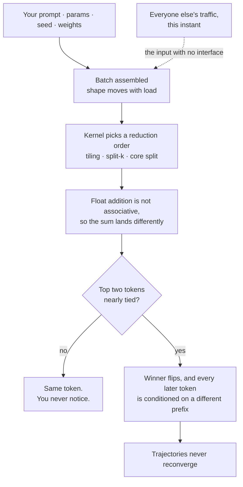
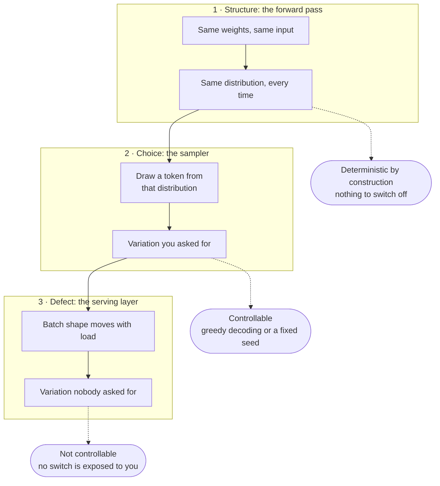

People keep telling me that large language models are non-deterministic, as though it were a property of the thing. It isn't. The model is a fixed function. What's non-deterministic is the machinery we've built around it to serve the model at scale, and that machinery is a set of choices somebody made, not a law of physics.

The distinction matters, because it decides whether you're stuck or whether someone owes you an explanation.

## Being wrong in public

The question came at me twice, from two different people: if everything else is the same, and two identical prompts reach an LLM, why would it produce a different result?

My answer both times was that the premise was false. Everything else *wasn't* the same. Something upstream had changed: a tool call returned different data, a timestamp moved, a retrieved document was updated, a system prompt got tweaked. I was searching the input space for the variable that shifted, because the alternative was that identical inputs produce different outputs, and that is not a thing functions do.

And I was right about the amplifier. One token's difference cascades unrecoverably. Each token conditions every token after it, the space of possible continuations is astronomically large, and two trajectories that diverge at token forty never converge again. You don't need a big perturbation to get a completely different essay. You need one token, once.

What I had wrong was where to look for it. I searched the inputs exhaustively and never searched the execution, because I'd modelled the system as a function of its declared inputs: the prompt, the parameters, the weights. That's what the documentation describes. That's what the API signature says. That's what a model *is*.

The variable wasn't in my inputs. It was in who else happened to be talking to the same machine at the same moment.

## Your prompt does not arrive alone

Your prompt doesn't reach the model by itself. It's grouped with whatever other requests are in flight at that instant, because grouping requests is how you keep a very expensive GPU busy. That group is a batch, and its size changes constantly with traffic.

Batch size changes the arithmetic. Here's the chain:

1. **Floating-point addition is not associative.** Every addition rounds, so the order you add in changes the answer. `(0.1 + 1e20) - 1e20` gives you 0. `0.1 + (1e20 - 1e20)` gives you 0.1. Same numbers, different order, different result.
2. **Every layer is full of long sums**: a matrix multiply row, a normalisation average, an attention softmax. Each has an order.
3. **That order is not fixed in the model.** It's chosen at runtime by the kernel, from the shape of the tensor: how to divide work across cores, what tile size to use, whether to split the inner dimension into chunks and combine partial sums afterwards.
4. **The shape depends on the batch. The batch depends on load. The load depends on other people.**
5. **A shift in the seventh decimal place meets a discontinuity.** Picking the highest-scoring token is a hard cut-off. If two candidates were nearly tied, the winner flips, and now you're in my cascade, on a trajectory that never comes back.

The whole chain, and where in it you stop having visibility:

So the answer to the question I was asked is: the inputs weren't identical, and I was right about that. I just couldn't have found the difference, because concurrent traffic doesn't appear in any interface I have access to.

One correction to the folk version of this story, which I believed for a while: this is not about GPU parallelism or race conditions. Forward passes don't rely on the kind of contended operations that produce genuine races, and the individual kernels are perfectly repeatable for a fixed shape. Endpoints served from CPUs and TPUs have the same problem. It's batch variation, not concurrency, and that matters because the fix is different. You don't have to stop distributing work, you have to make the kernels behave identically regardless of batch size.

## Three layers, and only one of them is a fault

The reason "LLMs are probabilistic, so of course they vary" keeps getting said is that three separate things have been collapsed into one word.

**Structure.** The forward pass is a deterministic function. Same weights, same input, same output, every time. What it emits is a probability distribution over the next token, but it produces that distribution deterministically. The model represents a likelihood; it does not compute by chance.

**Choice.** A sampler then draws from that distribution. This is deliberate randomness, added on purpose, because we generally want variety. It's also fully controllable: greedy decoding or a fixed seed switches it off.

**Defect.** Then the serving layer introduces variation nobody asked for, nobody documented, and nobody currently lets you turn off.

Stacked, the difference is which row you are allowed to touch:

You wouldn't blame the house's collapse on the structure if the ground beneath it folded in. The architecture is sound. Nothing about how these models are built produces this behaviour. It's introduced entirely below them, by the substrate we chose to stand them on, for reasons that have nothing to do with the models themselves.

The metaphor has one limit worth naming: unlike subsidence, this ground can be fixed, and the fix is known. Batch-invariant kernels, which force one reduction strategy regardless of batch size, restore bit-exact reproducibility. Both major open-source inference engines shipped this within weeks of the problem being properly diagnosed. It costs roughly 60% of throughput in a naive implementation and about a third once optimised.

Which brings us to the interesting question. If the fix exists and has existed, why is this still how everything works?

## Nobody in a position to fix it wanted it fixed

Not a conspiracy. Just an incentive structure where the people who bear the cost and the people who control the decision are different people.

| Who | Position | Why |
|---|---|---|
| Chat product teams | Against | "Regenerate" is a core interaction. A deterministic regenerate button returns the same answer and looks broken. |
| Anyone using best-of-n or self-consistency | Against | Sampling several times and voting requires the samples to differ. Free variance is free diversity. |
| Infrastructure teams | Against | It costs a third of serving capacity, minimum. |
| Model providers | Against | See below. |
| RL training teams | For | Numerical drift between training and inference silently turns on-policy methods off-policy. |
| Evaluation, audit, compliance | For | You cannot attest to an output you cannot reproduce. |

The provider row is the one nobody says out loud. Non-reproducibility is cover. If outputs can't be reproduced, you cannot demonstrate that a provider swapped weights, quantised the model, routed you to a cheaper variant, or degraded quality under peak load. Every one of those complaints becomes unfalsifiable, indistinguishable from the noise you've already been told to expect.

I'm not claiming anyone engineered it for that purpose. I'm pointing out that the incentive runs one direction and there was no countervailing pressure until reinforcement learning made the cost visible from the inside. That's what finally moved it: not user complaints, not auditors, but researchers discovering their training runs had been quietly broken for years by a numerical gap nobody was measuring.

Which is the pattern. Not that the problem was hard. That nobody was measuring the thing the problem was breaking.

## What I'd say now

Stop saying LLMs are non-deterministic. Say that serving an LLM is non-deterministic, because the serving layer introduces an input you can't see and can't control.

If it's the model, you're stuck and there's nothing to discuss. If it's the deployment, it's an engineering trade-off with a published price, and somebody made it on your behalf without telling you it was being made.
