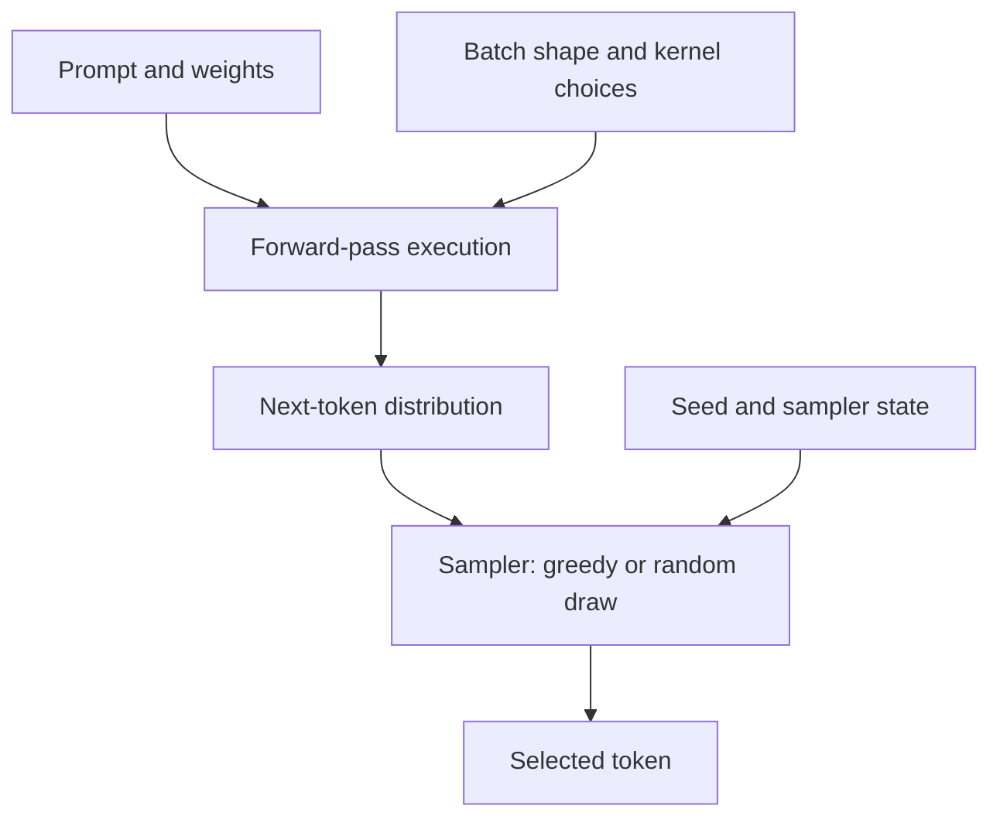

People keep telling me that large language models are non-deterministic, as though it were a property of the thing. It isn't. The model is a fixed function. What's non-deterministic is the machinery we've built around it to serve the model at scale, and that machinery is a set of choices somebody made, not a law of physics.

The distinction matters, because it decides whether you're stuck or whether someone owes you an explanation.

## Being wrong in public

The question came at me twice, from two different people: if everything else is the same, and two identical prompts reach an LLM, why would it produce a different result?

My answer both times was that the premise was false. Everything else *wasn't* the same. Something upstream had changed: a tool call returned different data, a timestamp moved, a retrieved document was updated, a system prompt got tweaked. I was searching the input space for the variable that shifted, because the alternative was that identical inputs produce different outputs, and that is not a thing functions do.

And I was right about the amplifier. One token's difference can cascade. Each token conditions every token after it, so a different token changes the prefix used for later predictions. The continuations may overlap or reach the same conclusion, but they can also become completely different responses. You don't need a big perturbation to get a completely different essay. You need one token, once.

What I had wrong was where to look for it. I searched the inputs exhaustively and never searched the execution, because I'd modelled the system as a function of its declared inputs: the prompt, the parameters, the weights. That's what the documentation describes. That's what the API signature says. That's what a model *is*.

The variable wasn't in my inputs. It was in who else happened to be talking to the same machine at the same moment.

## Your prompt does not arrive alone

Your prompt doesn't reach the model by itself. It's grouped with whatever other requests are in flight at that instant, because grouping requests is how you keep a very expensive GPU busy. That group is a batch, and its size changes constantly with traffic.

Batch size changes the arithmetic. Here's the chain:

1. **Floating-point addition is not associative.** Every addition rounds, so the order you add in changes the answer. `(0.1 + 1e20) - 1e20` gives you 0. `0.1 + (1e20 - 1e20)` gives you 0.1. Same numbers, different order, different result.
2. **Every layer is full of long sums**: a matrix multiply row, a normalisation average, an attention softmax. Each has an order.
3. **That order is not fixed in the model.** It's chosen at runtime by the kernel, from the shape of the tensor: how to divide work across cores, what tile size to use, whether to split the inner dimension into chunks and combine partial sums afterwards.
4. **The shape depends on the batch. The batch depends on load. The load depends on other people.**
5. **A shift in the seventh decimal place meets a discontinuity.** Picking the highest-scoring token is a hard cut-off. If two candidates were nearly tied, the winner flips, and now you're in my cascade, conditioning later predictions on a different prefix.

The whole chain, and where in it you stop having visibility:

So the answer to the question I was asked is: the inputs weren't identical, and I was right about that. I just couldn't have found the difference, because concurrent traffic doesn't appear in any interface I have access to.

One correction to the folk version of this story, which I believed for a while: parallel execution does not by itself explain the variation. Thinking Machines describes how common forward-pass kernels can be repeatable for a fixed shape while giving different results across batch shapes. That distinction matters because the fix is different. You don't have to stop distributing work, you have to make the kernels behave identically regardless of batch size.

## Three layers, and only one of them is a fault

The reason "LLMs are probabilistic, so of course they vary" keeps getting said is that three separate things have been collapsed into one word.

**Structure.** The forward pass is a deterministic function. Same weights, same input, same output, every time. What it emits is a probability distribution over the next token, but it produces that distribution deterministically. The model represents a likelihood; it does not compute by chance.

**Choice.** A sampler then draws from that distribution. This is deliberate randomness, added on purpose, because we generally want variety. Greedy decoding removes the random draw. A fixed seed makes the pseudorandom sequence repeatable, provided the sampler and execution remain stable; it does not repair changing numerics.

**Execution.** The serving layer can change that distribution as batch shapes change, even when you requested greedy decoding. There are documented ways to prevent this. Whether you can enable them depends on who controls the deployment.

The serving variation happens before the sampler chooses a token:

## The fix exists

In September 2025, Thinking Machines published [Defeating Nondeterminism in LLM Inference](https://thinkingmachines.ai/blog/defeating-nondeterminism-in-llm-inference/). It explains the batch-shape mechanism and demonstrates batch-invariant kernels: arithmetic whose results do not depend on which other requests share the batch. With those kernels enabled, all 1,000 completions in its test were identical.

This is available in serving software, too. [vLLM documents an opt-in batch-invariance mode](https://docs.vllm.ai/en/stable/features/batch_invariance/), enabled with `VLLM_BATCH_INVARIANT=1`. Its documentation marks the feature as beta, describes supported hardware and tested models, and warns of a possible performance impact. It is a supported path with constraints, not a guarantee for every deployment.

And vLLM is established production infrastructure. [LinkedIn reported more than 50 GenAI use cases across thousands of hosts](https://www.linkedin.com/blog/engineering/ai/how-we-leveraged-vllm-to-power-our-genai-applications) in August 2025. That establishes the engine's production relevance; it does not establish how many operators enable batch invariance.

The distinction is between an operator having a switch and an API customer receiving a guarantee. The first does not automatically give you the second.

## Why the fix isn't the default

There is a cost to constraining execution. In the Thinking Machines experiment, the same workload took 26 seconds with default vLLM, 55 seconds with unoptimized deterministic kernels, and 42 seconds after improving attention. For that workload, those times imply approximately 53% and 38% less throughput. They are measurements of one setup, not a universal price for reproducibility.

Still, the incentive is straightforward. If an operator serves fewer requests on the same hardware, maintaining capacity can require more hardware. That cost shows up directly. The benefit of reproducibility may show up elsewhere: less debugging time, more reliable regression investigations, or fewer failed training runs.

My argument is that this split helps explain why an available fix remains opt-in. I do not have an industry-wide adoption count. But when customers buy price, latency, and response quality without requiring exact replay, an operator has little immediate commercial reason to accept a throughput penalty for it.

| Workload | Reason to pay for reproducibility | Competing pressure |
|---|---|---|
| Interactive chat | Investigating regressions and reproducing reported failures | Cost and latency on every request |
| Evaluation and debugging | Isolating changes without serving variation obscuring the comparison | Extra serving cost and maintenance of a controlled environment |
| Reinforcement learning | Keeping rollout and training numerics aligned | Engineering effort across both stacks |

This does not mean deterministic serving prevents variety. Regeneration and best-of-n can still use different random draws. Repeatable arithmetic removes accidental variation; it does not require every sample to be identical.

The case for paying changes when numerical drift breaks something measurable. Thinking Machines demonstrated an RL setup where aligning sampling and training numerics enabled stable on-policy training. The economic inference is mine: once reproducibility prevents expensive failures, its cost has something concrete to be weighed against.

So I would not claim that nobody wants it fixed, or that providers need non-reproducibility as cover. The narrower argument is enough: throughput savings are immediate, while the value of reproducibility depends on the workload and who bears the cost of its absence.

## What I'd say now

When identical requests produce different outputs, ask which layer varied: the inputs, the sampler, or the execution. Batch-dependent numerics are one documented cause, and deterministic serving is one available answer.

The fix exists. Making it the default means someone must value the guarantee enough to pay for the constraints it imposes. Until then, a switch in a serving engine is not a promise from the endpoint you call.

## References

1. Horace He et al. [Defeating Nondeterminism in LLM Inference](https://thinkingmachines.ai/blog/defeating-nondeterminism-in-llm-inference/). Thinking Machines Lab, September 10, 2025.
2. vLLM. [Batch Invariance](https://docs.vllm.ai/en/stable/features/batch_invariance/). Documentation, accessed September 12, 2026.
3. Yingjiao (Shirley) Zhai et al. [How we leveraged vLLM to power our GenAI applications at LinkedIn](https://www.linkedin.com/blog/engineering/ai/how-we-leveraged-vllm-to-power-our-genai-applications). LinkedIn Engineering, August 26, 2025.
