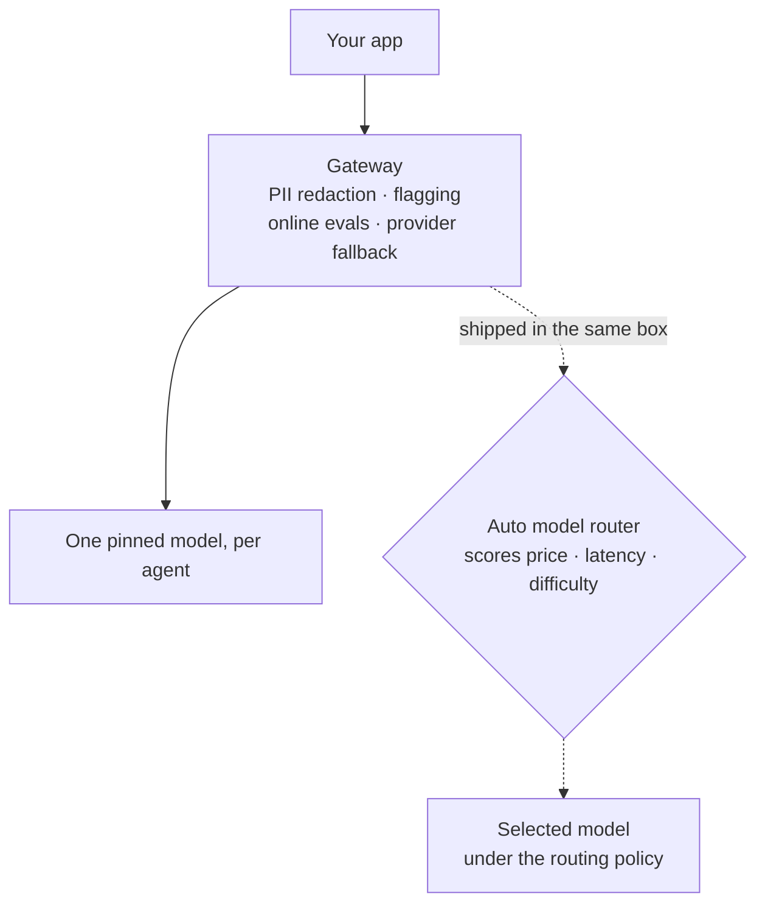
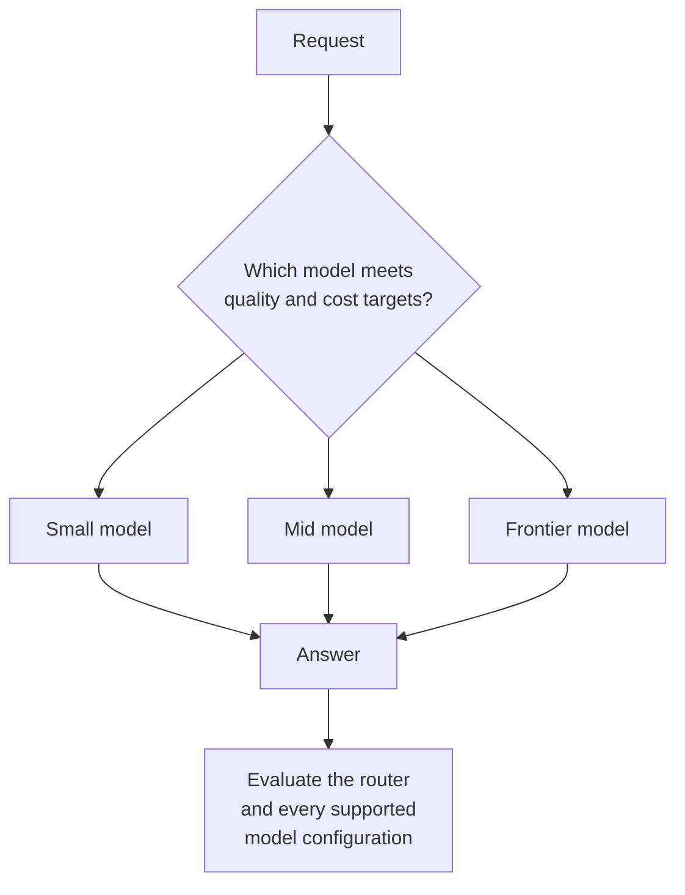
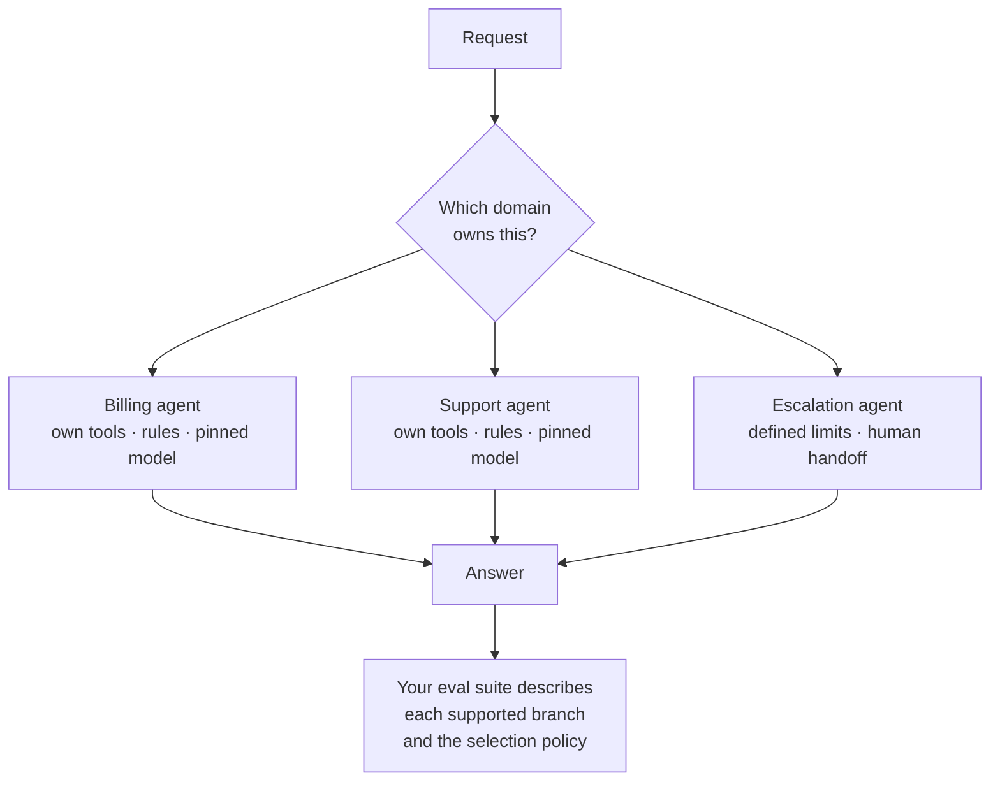

Your business does not need to solve AGI. It needs to solve the problems customers pay it to solve, quickly, cheaply, and correctly.

That is the argument for routing work to specialized agents. Give each a narrow responsibility, relevant context, appropriate tools, and explicit checks. Then treat model choice as a parameter to test within that system. The competitive advantage comes from how well the complete workflow performs.

## The idea

There is something to be said for a dedicated service that every model call goes through. PII redaction, message flagging, fallback on provider outage, online evals: all of that wants a single egress point, and building it once is straightforward engineering. None of it requires automatic routing at the model level.

Model routing and a model gateway are two different products that keep arriving in the same box. Each solves a different problem. A gateway centralizes access and operational policy; a model router chooses which model handles a request. Either has to justify its overhead.

## Specialize the work first

Agent routing chooses which workflow owns a request. A coordinator can also invoke a specialist as a subagent for one bounded part of a larger task. Neither requires a different model: two agents using the same weights can behave differently because their instructions, tools, context, and checks differ.

Consider a disputed invoice. A billing specialist needs the invoice, account terms, and payment tools. A delivery specialist needs shipment records. They can return concise findings and supporting evidence to a coordinator, without each receiving the entire conversation and every other specialist’s tool history. Independent checks can run in parallel; dependent actions must wait for their prerequisites.

That separation can reduce irrelevant context and repeated processing of large tool outputs. It can also shorten elapsed time when work is independent. Anthropic describes subagents exploring in separate context windows and compressing their findings for a lead agent. Its research system also used substantially more total tokens than ordinary chat: context isolation is not itself a guarantee of lower total usage. [13]

The savings come from disciplined boundaries: send only the required context, bound the task and tool budget, and return the result with enough evidence to verify it. Spawning several agents that each reread the same history and repeat the same search can erase the benefit. Measure all calls, including coordination and retries.

Specialization also makes correctness concrete. An invoice total can be checked with code; a refund can be checked against account policy; a delivery claim can be checked against a source record. A narrower agent gives you fewer responsibilities to validate and more specific failure cases to improve.

## The model is a parameter inside the harness

**The unit you ship is the model plus its harness.** By harness, I mean the prompts, tools, context management, execution loop, checks, and recovery behavior around the model. Those conditions affect what the model can accomplish. A lower-ranked model can still be the better choice for a particular workflow; a general benchmark ranking cannot settle that comparison for you. Measure the complete agent on your tasks.

Staying with a model lets you accumulate validated improvements to those conditions. You learn which tool descriptions it follows, when it needs a check, how to compact its context, and which failures require recovery. That is an engineering reason for stickiness. Changing the model introduces another variable into a system whose behavior you have already tuned.

### Astra makes the coupling concrete

**GPT-6 Astra** illustrates this coupling. Its model guide documents several behaviors that need application-specific prompting: it may ask for clarification when the user expects continued work, react strongly to instructions in skills and `AGENTS.md`, delegate less often than desired, or test more broadly than a small change warrants. The guide recommends adjusting those instructions to match the harness. Its asynchronous tool calls also require the application to execute tools and manage pending work. [1]

That is a concrete example of model-specific integration work. It is not a controlled demonstration that a weaker model outperforms Astra, or a measurement of the benefit of any one prompt. The narrower point is sufficient: changing the model can change what a suitable harness looks like.

**Routing expands what you must validate.** A router is another policy whose behavior can change outcomes. You can evaluate it: run the production routing policy, exercise each supported model and harness configuration, test fallback paths, and record which configuration handled each request. The problem is assuming that an evaluation of one pinned model also validates the routed system.

A shared harness may work across several models. Where it does not, you maintain adaptations for each. If routing happens mid-session, you also have to validate how the next model interprets the accumulated tool results and conversation state. Those are costs that a token-price comparison leaves out.

**Stickiness also affects cache economics.** Long sessions accumulate reusable prefixes: instructions, tool definitions, history, and retrieved context. Changing models or providers can lose cache reuse and introduce new input-processing costs. The exact rules depend on the serving service; a cache hit is not guaranteed merely because the model name stays fixed. OpenRouter documents provider stickiness for prompt caching and separate session stickiness for its automatic model router. Its automatic router can still change models when its ranking calls for it. [2][3]

**Specialization includes tools and context.** Selecting a billing agent can choose domain rules, permissions, retrieval, and a tested model together. That gives you a useful boundary for evaluation. Model selection can also be useful inside that boundary, but it needs evidence of its own.

Model routing chooses a model within a defined workflow:

Agent routing selects the workflow, including its tools, context, and validation:

When an answer is poor, diagnose the failing step. Missing context, an unsuitable tool, or a weak recovery loop calls for a different fix than insufficient model capability. Start with a tested model per agent; add model selection when measurements justify it.

### Test model choice deliberately

A model is a useful experimental parameter. Establish a baseline for each specialist, then compare candidate models on the same representative tasks, with explicit quality checks and a cost and latency budget. Start with the harness fixed to see what changing the model does. If a candidate needs different prompts or tools, test that adapted configuration separately and record the whole configuration that produced the result.

You can then test a model-routing policy within that specialist: a cheaper model for a validated subset of work, escalation for harder cases, or selection based on observed task features. Evaluate that policy end to end, including selection errors and fallback costs. This is compatible with agent routing. It adds a decision inside a workflow whose responsibility is already clear.

### Specialization is a business advantage to earn

A focused system can be faster because it performs fewer irrelevant steps and parallelizes independent work. It can be cheaper because it carries less unnecessary context and uses an adequate model for each task. It can be more correct because its retrieval, tools, and checks match the domain. Those are mechanisms to exploit, not automatic rewards for adding agents.

Compete on the work customers actually bring you. Measure completion time, total cost per successful task, and task-specific correctness against the current system and credible alternatives. Improve the specialist that limits those results. You do not need general superiority over every model or every competitor to build a better product for a particular job.

## What the tools actually do

These projects occupy different layers, and their adoption does not establish that automatic model routing is the default:

| Project | What happens in the request path | Why use it, and what you take on |
|---|---|---|
| Anyscale / Ray Serve | Anyscale manages Ray infrastructure; Ray Serve runs and scales application deployments, which can contain inference engines and routing logic. | Useful for distributed applications and managed operations. You still design the application and pay for its compute and operational choices. [4] |
| vLLM | An inference engine schedules requests and runs model weights, using batching and efficient attention-memory management. | Useful for serving supported open models efficiently. You own capacity, model configuration, and deployment behavior. It is not inherently a quality-based model router. [5] |
| SGLang | A serving runtime reuses shared prefixes and schedules inference; its surrounding tooling supports distributed serving. | Useful for workloads with reusable context and high serving demand. Hardware and feature compatibility still constrain deployment. [6] |
| RouteLLM | A learned policy selects between a stronger and weaker model using a configurable threshold. | Can reduce expensive-model calls when its predictions transfer to your workload. Router evaluation, training-data fit, and misrouted requests matter. [7] |
| OpenRouter | A unified API routes requests to providers, supports model fallbacks, and optionally chooses models through an automatic router. | Useful for provider access and operational flexibility. Explicitly configure which provider or model decisions you delegate. [2][3][8] |

LMSYS, the Large Model Systems Organization, is the research organization associated with projects including SGLang and RouteLLM. It is not another interchangeable serving product. [9]

vLLM is already used in production. LinkedIn reported more than 50 generative-AI use cases across thousands of hosts in 2025. That is concrete deployment evidence, not a count of all vLLM users and not evidence that those applications switch models automatically. Public download totals cannot tell us how many people or production systems use it. [10]

RouteLLM provides evidence that model routing can work: its paper reports substantial cost reductions while preserving a target level of quality on evaluated benchmarks. Those findings concern specified models, datasets, and routing policies. They do not establish savings for a long-running agent with model-specific tools, cached context, and recovery behavior. [7]

## The cost incentive has to survive the whole system

Compare **cost per successful task** at an acceptable quality and latency level. Include router calls, input and output tokens, cache misses, retries, escalation, and the engineering work needed to maintain and evaluate each supported configuration. Amortize that engineering work over the actual workload.

At sufficient volume, routing savings can outweigh those costs. For a modest workload with a well-tuned agent, the savings may be too small to justify another moving part. The relevant claim is conditional: routing needs a demonstrated net benefit. There is no basis here for declaring either universal savings or universal lack of incentive.

The same distinction matters for [deterministic serving](/blog/stop-calling-llms-non-deterministic). vLLM and SGLang offer opt-in mechanisms, but availability is not adoption. Their constraints and performance trade-offs must be evaluated on the deployed stack. Serving reproducibility and application-level model selection are separate decisions. [11][12]

## The decision

Route work to the specialist that owns it. Invoke subagents where bounded context or parallel work improves the workflow. Treat model choice, including a routing policy, as a parameter to evaluate inside that specialist.

Keeping a tested model stable lets harness improvements accumulate. Changing it is justified when the complete system improves. The target is a specialized business workflow that delivers faster, cheaper, and more correct results, measured on the tasks that matter.

## References

1. [OpenAI. Model guidance: Using GPT-6 Astra.](https://developers.openai.com/api/docs/guides/latest-model)
2. [OpenRouter. Prompt caching.](https://openrouter.ai/docs/guides/best-practices/prompt-caching)
3. [OpenRouter. Auto Router, including session stickiness.](https://openrouter.ai/docs/guides/routing/routers/auto-router)
4. [Anyscale. Architecture.](https://docs.anyscale.com/get-started/architecture) See also [Anyscale Services](https://docs.anyscale.com/services).
5. [vLLM. Paged attention.](https://docs.vllm.ai/en/stable/design/paged_attention/)
6. [Zheng et al. SGLang: Efficient Execution of Structured Language Model Programs.](https://arxiv.org/abs/2312.07104)
7. [Ong et al. RouteLLM: Learning to Route LLMs from Preference Data.](https://arxiv.org/abs/2406.18665)
8. [OpenRouter. Provider routing.](https://openrouter.ai/docs/guides/routing/provider-selection)
9. [LMSYS. About.](https://www.lmsys.org/about/)
10. [LinkedIn Engineering. How we leveraged vLLM to power our GenAI applications, 2025.](https://www.linkedin.com/blog/engineering/ai/how-we-leveraged-vllm-to-power-our-genai-applications)
11. [vLLM. Batch invariance.](https://docs.vllm.ai/en/stable/features/batch_invariance/)
12. [SGLang. Deterministic inference.](https://docs.sglang.io/docs/advanced_features/deterministic_inference)
13. [Anthropic. How we built our multi-agent research system, 2025.](https://www.anthropic.com/engineering/multi-agent-research-system)
