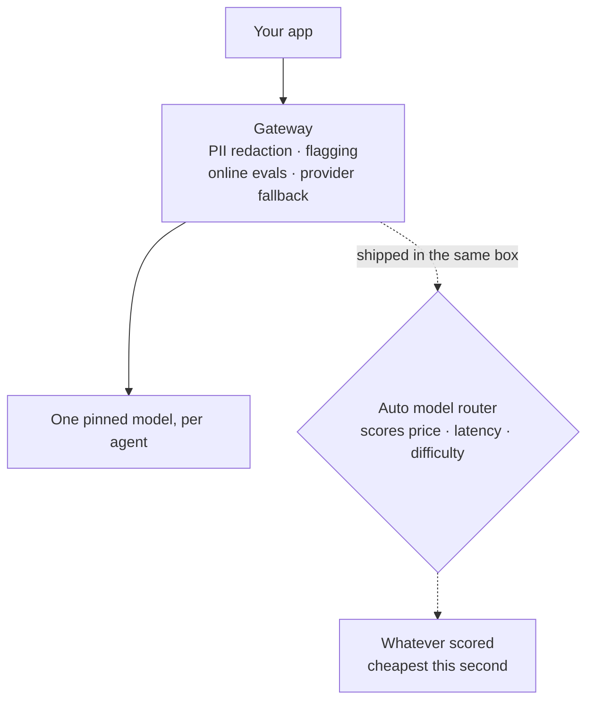
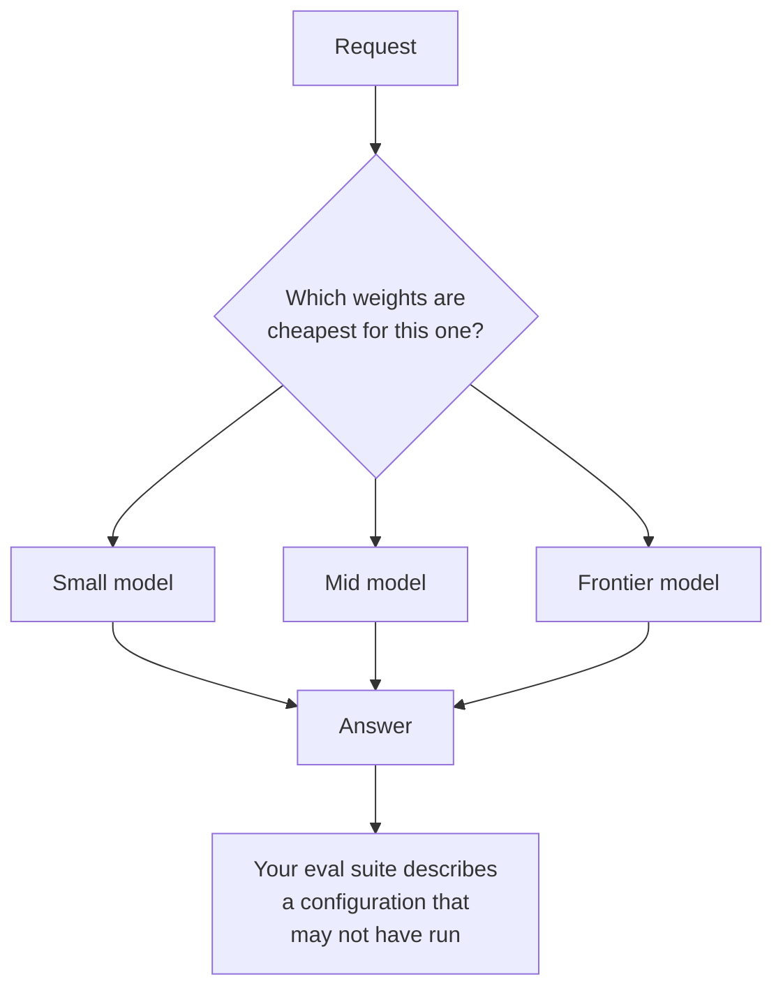
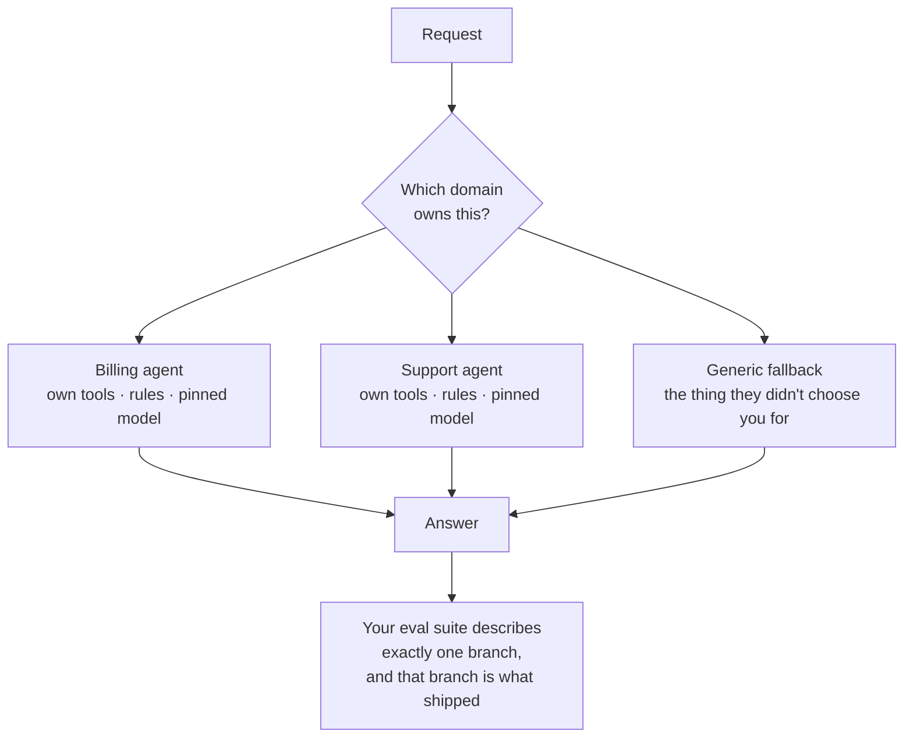

Thy model shall remain sticky throughout thy session, for otherwise thy bill might skyrocket.

That's the whole post, but it's worth explaining why, because the industry is currently selling the opposite and charging you a percentage of the savings it claims to find.

## The idea

There is something to be said for a dedicated service that every model call goes through. PII redaction, message flagging, fallback on provider outage, online evals: all of that wants a single egress point, and building it once is straightforward engineering. None of it requires automatic routing at the model level.

Model routing and a model gateway are two different products that keep arriving in the same box. The gateway is worth the hop. The routing is the part that costs you.

## Why it holds

**Stickiness is a cost mechanic, not a preference.** A long session accumulates a prefix: system prompt, tool definitions, conversation history, retrieved context. That prefix is cached, and the cache belongs to one model on one provider. Swap models mid-session and you don't just pay the cheaper per-token rate, you pay to re-ingest everything the previous model had already amortized. A router optimizing per-request price against a static rate card is optimizing a number that doesn't describe your bill.

**Auto-routing removes the thing you were testing.** The point of an eval suite is that it describes what ships. If the model underneath a request is chosen at runtime by a policy you didn't write, your suite describes one configuration and production serves another. You have traded a measurable system for an adaptive one, and adaptive systems are exactly the ones you cannot attest to. That's the same failure as [serving-layer non-determinism](/blog/stop-calling-llms-non-deterministic): an input you can't see, introduced below the layer you thought you controlled.

**The unit of specialization is the agent, not the weight.** Mixture of experts works because routing happens inside a single trained objective, where the router is learned against the same loss as the experts. At the application layer there is no shared objective. What distinguishes a good response from a bad one is the tools it had, the context it retrieved, the domain rules it respected, and the prompt that framed it. The model is one term in that expression, and usually not the one that's wrong.

The two are routing on different questions. Here is what's being sold:

Now the same request, routed on the question that actually determines the answer:

So when the answer is poor, swapping in a bigger model is the least targeted fix available. Route to the agent that owns the domain, and let that agent pin its model.

**Optimal generality is the failure mode.** I keep seeing teams pull focus away from testing and hand the decision to the system, on the theory that the system will find the optimum. What they've actually built is something that serves every use case rather than the business ones. Domain definitions are not overhead. They are the artifact that lets you say which requests you are accountable for.

General fallbacks are fine for generic questions, but that's the trap: if a user could have gotten the answer generically, why did they choose you?

## Who's selling this

Watch where the money is. The consolidation in the routing space and the push to price on "savings delivered" both point the same direction: a layer that inserts itself between you and the provider, bills as a share of a number it also computes, and adds one more service your data passes through.

Reducing the number of hops your data takes is a real argument for a gateway. It is an argument against a router that needs to see every request to decide where it goes.

## The leverage

A decision test, two questions:

1. Does the choice change which *tools and context* the request gets? Then it's agent selection. Route it, test each branch, pin the model per branch.
2. Does the choice only change which *weights* answer? Then it's model selection. Don't automate it. Pick one, measure it, change it deliberately when the measurement says to.

Routing is important. It just belongs one layer up from where it's being sold.

## The line

You don't need model selection, you need agent selection. A router that swaps models per request doesn't make your system cheaper. It makes your evals describe a system that no longer ships.
